# Voting Assistant

> Interaktiver politischer Orientierungsassistent für Schweizer Abstimmungen und Parteien.
> Studentischer Prototyp im Modul **Prototyping** (ZHAW, FS 2026) — **keine offizielle Abstimmungshilfe.**

[](https://friendly-llama-b738d4.netlify.app)
[](https://github.com/adinho11-git/voting-assistant)
[](#tech-stack)
[](https://abstimmungen.admin.ch/)

---

## Inhalt

1. [Projektüberblick](#projektüberblick)
2. [Zielgruppe und Problem](#zielgruppe-und-problem)
3. [Wichtigste User-Workflows](#wichtigste-user-workflows)
4. [Features](#features)
5. [Bezug zum Bewertungsraster](#bezug-zum-bewertungsraster)
6. [Sketches, Mockups und Prototyping-Artefakte](#sketches-mockups-und-prototyping-artefakte)
7. [Tech Stack](#tech-stack)
8. [Architektur und Datenüberblick](#architektur-und-datenüberblick)
9. [Setup und Installation](#setup-und-installation)
10. [Deployment](#deployment)
11. [Screenshots](#screenshots)
12. [Projektdokumentation (`docs/`)](#projektdokumentation-docs)
13. [Evaluation](#evaluation)
14. [KI-Einsatz](#ki-einsatz)
15. [Rechtliche und ethische Hinweise](#rechtliche-und-ethische-hinweise)
16. [Bekannte Grenzen und Future Work](#bekannte-grenzen-und-future-work)
17. [Video-Walkthrough](#video-walkthrough)
18. [Projektkontext](#projektkontext)

---

## Projektüberblick

Der **Voting Assistant** ist eine SvelteKit-Webanwendung, die Stimmberechtigte in der Schweiz vor jeder eidgenössischen Abstimmung durch einen klaren Sechs-Schritte-Workflow führt:

> **Verstehen → Abwägen → Gewichten → Einordnen → Entscheiden → Speichern**

Statt nur Informationen aufzubereiten oder eine fertige Wahlempfehlung zu liefern, ermöglicht die App den Nutzer:innen, **selbstständig** Argumente zu gewichten, eine eigene Position mit Sicherheit und Notiz festzuhalten und im **persönlichen Voting-Journal** zu dokumentieren. Alle persönlichen Daten bleiben lokal im Browser.

Ergänzt wird der Hauptworkflow durch einen **Partei-Kompass** mit 18 Szenario-Fragen, einen **Parteienbereich** mit Vergleich und Positionen-Matrix sowie eine **Quellen- und Medienberichte-Seite**, die amtliche Grundlagen, Parteiquellen und journalistische Einordnungen sauber trennt.

---

## Zielgruppe und Problem

### Problem

Vor jeder eidgenössischen Abstimmung in der Schweiz konkurrieren Bundesbüchlein, Komitee-Kampagnen, Parteiparolen, Medienberichte und Social-Media-Beiträge um Aufmerksamkeit. Die Folge:

- **Informations-Überlastung** bei begrenzter Zeit.
- **Asymmetrische Quellen** (Komitee-Texte sind einseitig, News-Aggregatoren ordnen Argumente selten Pro/Contra-strukturiert).
- **Fehlende Reflexionsstütze**: Wer wenige Wochen nach der Abstimmung gefragt wird, warum so gestimmt wurde, kann die eigenen Gründe oft nicht mehr rekonstruieren.
- **Black-Box-Effekt** bei bestehenden Quiz-Apps: Wahlempfehlungen wirken algorithmisch, der Berechnungsweg ist nicht immer offen.

### Zielgruppe

Stimmberechtigte in der Schweiz, die sich strukturiert eine eigene Meinung bilden möchten — insbesondere:

- **Erst- und Gelegenheitswählende**, die einen verständlichen Einstieg brauchen.
- **Politisch interessierte Personen**, die mehrere Quellen kompakt vergleichen möchten.
- **Mobile-First-Nutzer:innen**, die sich kurz vor der Abstimmung unterwegs informieren.

Eine ausführliche Persona-Beschreibung findet sich in [`docs/01-understand.md`](docs/01-understand.md).

---

## Wichtigste User-Workflows

| # | Workflow | Schritte |
|---|---|---|
| 1 | **Abstimmung verstehen und Position speichern** | Startseite → Übersicht → Detailseite → Briefing lesen → Pro/Contra prüfen → Position mit Sicherheit und Notiz speichern |
| 2 | **Argumente gewichten** | Detailseite → Abschnitt «Abwägen» → pro Argument 0–3 Punkte → Live-Tendenz beobachten → gewichtete Tendenz ins Journal übernehmen |
| 3 | **Partei-Kompass absolvieren** | Bottom-Nav / Top-Nav «Kompass» → 18 Fragen beantworten (überspringbar) → Ranking + Themen-Breakdown ansehen → Ergebnis lokal speichern |
| 4 | **Profil / Voting-Journal nutzen** | Profil → Statistiken, Kompass-Ergebnis, Merkliste, Partei-Übereinstimmung aus eigenen Stimmen, Aktivitäten-Timeline |
| 5 | **Quellen prüfen** | Quellen & Medienberichte → amtliche Quellen, Parteiquellen, Medienberichte (filterbar) → direkter Sprung zur Originalquelle |
| 6 | **Daten pflegen (Admin)** | `/admin/login` → Dashboard → Abstimmungen / Argumente / Parteipositionen pflegen, Interessen-Registrierungen als CSV exportieren |

Detaillierte Beschreibung der Workflows mit konkreten Code-Referenzen in [`docs/04-prototype.md`](docs/04-prototype.md).

---

## Features

### Hauptbereich (öffentlich)

| Bereich | Inhalt |
|---|---|
| **Startseite** | Hauptnutzen, Countdown zur nächsten Abstimmung, anstehende Vorlagen, Workflow-Erklärung, Methodik, vergangene Resultate, FAQ, KI-Transparenz |
| **Abstimmungsübersicht** | Tabs «Anstehend» / «Vergangen», Suche, Filter, Resultats-Karten mit Stimmbeteiligung |
| **Detailseite** | Geführter Entscheidungs-Assistent über fünf Sektionen (Überblick, Argumente, Parteien, Meine Position, Quellen) |
| **Argument-Detail** | Erweiterte Erklärung pro Argument mit Originalquelle und Datum |
| **Parteienübersicht** | 6 Bundesparteien (SP, GP, GLP, Mitte, FDP, SVP) mit Filter (Links/Mitte/Rechts), Spektrums-Visualisierung |
| **Parteivergleich** | Zwei Parteien direkt nebeneinander mit Eckdaten und Slogan |
| **Positionen-Matrix** | Alle sechs Parteien × ausgewählte Vorlagen — JA/NEIN auf einen Blick |
| **Parteidetailseite** | Profil, Kernthemen, Spektrum 2D (Links-Rechts / Wirtschaft-Umwelt), Positionen zu aktuellen Vorlagen |
| **Partei-Kompass** | 18 realistische Schweizer Szenario-Fragen aus 10 Themenbereichen, 5-Stufen-Skala, überspringbar, Ranking + Themen-Breakdown + transparente Erklärung der Berechnung |
| **Profil / Voting-Journal** | Stimm-Historie, Kompass-Ergebnis, automatisch berechnete Partei-Übereinstimmung aus den eigenen Stimmen, Aktivitäten-Timeline |
| **Quellen & Medienberichte** | Getrennte Auflistung amtlicher Quellen, Parteiquellen, Medienartikel mit Filter, expliziter Methodik-Hinweis |

### Admin-Bereich (passwortgeschützt)

| Bereich | Inhalt |
|---|---|
| **Dashboard** | System-Status (Mock-Modus / MongoDB Atlas), Zähler für Vorlagen / Interessen / Community-Votes |
| **Vorlagen-CRUD** | Anlegen, Bearbeiten, Löschen; Argumente Pro/Contra hinzufügen oder entfernen; Parteipositionen pflegen |
| **Interessen-Registrierungen** | Eingegangene Anfragen einsehen, CSV-Export mit UTF-8-BOM (Excel-kompatibel) |
| **Community-Stimmen** | Aggregierte JA/NEIN-Statistik pro Vorlage |

### Foundations

- **Dark Mode** mit Theme-Persistenz (`localStorage`) und FOUC-freier Initialisierung.
- **Disclaimer-Ribbon** (dismissbar) kennzeichnet die App als studentischen Prototyp.
- **Datenqualitäts-Badges** (`official` / `official-pending` / `demo`) auf jeder Vorlage.
- **Toast-Notifications** für alle Speicher-Aktionen.
- **Accessibility**: Skip-Link, ARIA-Labels, `focus-visible`, `prefers-reduced-motion`.
- **Responsive**: Top-Nav (Desktop) und Bottom-Nav (Mobile) ohne horizontalen Overflow.
- **SEO**: pro Seite Title und Description, Canonical-URLs, OG-Tags.

---

## Bezug zum Bewertungsraster

Die Tabelle zeigt, wo im Repo welches Kriterium belegt ist.

### A) Mindestumfang

| Kriterium | Punkte | Beleg im Projekt |
|---|---|---|
| Kernfunktionalität & technische Qualität | 15 | Mehrere Pages und Workflows, MongoDB mit In-Memory-Fallback, Admin-CRUD, strukturiertes Datenmodell in [`src/lib/types.ts`](src/lib/types.ts) |
| Nutzerzentrierung & Bedienbarkeit | 15 | Sechsstufiger Workflow konsistent im UI sichtbar, Live-Feedback, Toast-System, Mockup-Bezug dokumentiert in [`docs/03-decide.md`](docs/03-decide.md) und [`docs/mockups/`](docs/mockups/README.md) |
| Vorgehen | 15 | Phasen Understand → Sketch → Decide → Prototype → Validate vollständig dokumentiert in [`docs/01-understand.md`](docs/01-understand.md) bis [`docs/05-validate.md`](docs/05-validate.md) |
| Evaluation | 10 | Plan, Testaufgaben, Beobachtungstabelle und Auswertungsstruktur in [`docs/05-validate.md`](docs/05-validate.md) |
| Dokumentation & Video | 5 | Diese README, vollständige `docs/`-Struktur, Drehbuch für 5-Minuten-Walkthrough in [`docs/video-script.md`](docs/video-script.md) |

### B) Erweiterungen

| Kriterium | Punkte | Beleg im Projekt |
|---|---|---|
| Hohe Qualität im Mindestumfang | 10 | Robuste Code-Struktur, TypeScript strict, Accessibility, Dark Mode, Mobile-First |
| Produkt-/Funktions-Erweiterungen | 15 | Partei-Kompass, Argument-Gewichtung, Voting-Journal mit Activity-Timeline, Parteienvergleich, Positionen-Matrix, Community-Votes, CSV-Export, MongoDB-Anbindung, SwissPartyMap |
| Zusätzliche Methoden / Artefakte | 10 | Persona, Crazy-8s, Dot-Voting, Figma-Wireframe, MoSCoW-Priorisierung, Mockup-Phase, Variantenvergleich, KI-Einsatz-Reflexion, technische Schulden mit Massnahmen — siehe [`docs/02-sketch.md`](docs/02-sketch.md), [`docs/03-decide.md`](docs/03-decide.md), [`docs/mockups/`](docs/mockups/README.md), [`docs/06-ki-einsatz.md`](docs/06-ki-einsatz.md), [`docs/07-projektorganisation.md`](docs/07-projektorganisation.md) |
| Projektorganisation | 5 | Repo-Struktur, Branch- und Commit-Strategie, Issue-Vorschläge, Deployment-Prozess, Artefakt-Ablage — siehe [`docs/07-projektorganisation.md`](docs/07-projektorganisation.md) |

### Mindestanforderungen

| Anforderung | Stand |
|---|---|
| SvelteKit-App | ✅ |
| Online zugängliche App | ✅ Netlify-Deployment |
| GitHub-Repository mit Code und Dokumentation | ✅ |
| Mehrere Pages und Workflows | ✅ 19+ Routen |
| Daten aus Datenquelle | ✅ MongoDB Atlas bei `MONGODB_URI` + `USE_MOCK_DATA=false`, mit Seed-/Fallback-Datenmodus |
| Daten erstellen / aktualisieren | ✅ Admin-CRUD, Community-Votes, Interessen-Registrierungen und lokale persönliche Daten |
| Evaluation mit Auswertung | ✅ Qualitative Evaluation mit P1–P5, Feedback Grid, Schweregrad-Skala, Auswertung und abgeleiteten Verbesserungen in [`docs/05-validate.md`](docs/05-validate.md) |
| Rechtliche Rahmenbedingungen | ✅ Quellen verlinkt, Disclaimer, keine personenbezogene Server-Speicherung |
| KI-Einsatz transparent | ✅ Doku in [`docs/06-ki-einsatz.md`](docs/06-ki-einsatz.md), In-App-Transparenz auf Start- und Quellen-Seite |

---

## Sketches, Mockups und Prototyping-Artefakte

Die frühen Sketch- und Mockup-Artefakte sind unter [`docs/mockups/`](docs/mockups/README.md) abgelegt und in den Phasen-Dokumenten eingeordnet:

- [`docs/02-sketch.md`](docs/02-sketch.md) dokumentiert Crazy-8s, acht Varianten des Briefing-Screens, Dot-Voting, Peer-Feedback und die Entscheidung für Split Screen Pro/Contra mit Parteienraster und Quellen-Transparenz.
- [`docs/03-decide.md`](docs/03-decide.md) erklärt, wie der Mobile-First-Figma-Wireframe aus Übung 10 in eine responsive SvelteKit-Web-App übersetzt und erweitert wurde.
- [`docs/04-prototype.md`](docs/04-prototype.md) zeigt tabellarisch, welche Mockup-Elemente im finalen Prototyp erkennbar umgesetzt und welche Funktionen später ergänzt wurden.

Der finale Prototyp entstand damit nachvollziehbar aus **Crazy-8s → Dot-Voting → Figma-Wireframe → Evaluation → iterativer SvelteKit-Umsetzung**. Das Bewertungsraster-Kriterium, dass ein Mockup verwendet wurde und in UI beziehungsweise Flows erkennbar ist, wird durch diese Artefakte und die dokumentierte Überleitung erfüllt. Gleichzeitig ist die finale App keine 1:1-Kopie des Mockups, sondern eine erweiterte Web-App mit zusätzlichen Workflows wie Argumentgewichtung, Partei-Kompass und Voting-Journal.

---

## Tech Stack

| Bereich | Technologie |
|---|---|
| Framework | SvelteKit 2 (`@sveltejs/kit 2.5.28`) |
| UI-Bibliothek | Svelte 4 (`4.2.20`) |
| Sprache | TypeScript 5.4 (strict) |
| Styling | Tailwind CSS 3.4 + eigenes CSS-Variablen-Token-System in [`src/app.css`](src/app.css) |
| Datenbank | MongoDB 6.6 (Atlas) mit In-Memory-Fallback |
| Hosting | Netlify (`@sveltejs/adapter-netlify 4.4.2`) |
| Auth | Cookie-basiert in [`src/hooks.server.ts`](src/hooks.server.ts) |
| Entwicklung | Vite, `svelte-check`, VS Code |

---

## Architektur und Datenüberblick

```
voting-assistant/
├── src/
│   ├── app.css                  # Token-System + Dark Mode + Global Styles
│   ├── app.html                 # FOUC-freie Theme-Initialisierung
│   ├── hooks.server.ts          # Admin-Auth via Cookie
│   ├── lib/
│   │   ├── realData.ts          # Kuratierte Schweizer Abstimmungsdaten (admin.ch)
│   │   ├── parteiData.ts        # 6 Bundesparteien mit Spektrums-Werten
│   │   ├── kompass.ts           # Kompass-Fragen + Matching-Algorithmus
│   │   ├── types.ts             # Zentrales Type-System
│   │   ├── components/          # Wiederverwendbare UI-Komponenten (17+)
│   │   ├── stores/              # votes, engagement, theme, toast, kompass
│   │   └── server/              # DB-Abstraktion, dataLayer, In-Memory-Stores
│   └── routes/
│       ├── +page.svelte         # Startseite
│       ├── abstimmungen/        # Übersicht + Detail + Argumente + Parteien
│       ├── parteien/            # Übersicht + Detail
│       ├── kompass/             # Partei-Kompass
│       ├── profil/              # Voting-Journal
│       ├── quellen/             # Quellen & Medienberichte
│       ├── admin/               # CRUD, geschützt
│       └── api/                 # Server-Endpoints (Voting, Interessen, CSV)
├── docs/                        # Projekt-Dokumentation (Phasen, Mockups, Screenshots, Video)
├── static/                      # Favicon u.a.
└── scripts/seed.mjs             # Optionaler MongoDB-Seed
```

**Datenflüsse:**

- **MongoDB / Server-Daten** (Abstimmungen, Argumente, Parteipositionen, Community-Votes, Interessen-Registrierungen): über die `dataLayer`-Schicht aus MongoDB Atlas geladen, wenn `MONGODB_URI` gesetzt ist und `USE_MOCK_DATA=false` gilt.
- **Seed-/Fallback-Daten**: Wenn MongoDB nicht aktiv oder nicht erreichbar ist, nutzt die App strukturierte Seed-Daten aus `realData.ts` sowie In-Memory-Stores. Dadurch bleibt der Prototyp lokal und im Demo-Fall lauffähig.
- **Statische strukturierte Daten**: Parteienprofile und Kompass-Fragen liegen in TypeScript-Dateien (`parteiData.ts`, `kompass.ts`), weil sie keine User- oder Admin-Daten sind.
- **Persönliche User-Daten** (Stimmen, Notizen, Sicherheit, Bookmarks, Kompass-Resultate, Argumentgewichtungen): ausschliesslich im `localStorage`.
- **Admin-CRUD**: persistiert bei aktiver MongoDB-Verbindung direkt in die Collection `abstimmungen`, sonst im In-Memory-Fallback.

**MongoDB-Collections:**

| Collection | Zweck |
|---|---|
| `abstimmungen` | Vorlagen, Briefings, Pro-/Contra-Argumente und Parteipositionen |
| `communityVotes` | Anonyme aggregierte JA/NEIN-Stimmen pro Vorlage |
| `parteiInteressen` | Interessen-Registrierungen aus dem Parteienbereich |

**CRUD-Erfüllung für das Bewertungsraster:**

- Admin kann Abstimmungen erstellen, bearbeiten und löschen.
- Admin kann Metadaten, Pro-/Contra-Argumente und Parteipositionen pflegen.
- User können Community-Votes abgeben; bestehende Stimmen werden pro Browser-Cookie aktualisiert.
- User können persönliche Positionen, Notizen, Argumentgewichtungen, Feedback und Kompass-Ergebnisse lokal speichern, ändern oder löschen.
- Interessen-Registrierungen werden serverseitig erfasst und im Admin-Bereich als CSV exportierbar gemacht.

---

## Setup und Installation

**Voraussetzungen:** Node.js 18+ (empfohlen 20+), npm.

```bash
# Repository klonen
git clone https://github.com/adinho11-git/voting-assistant.git
cd voting-assistant

# Abhängigkeiten installieren
npm install

# Lokal starten (Mock-Modus, keine DB nötig)
npm run dev
# → http://localhost:5173/
```

### Optional mit MongoDB Atlas

`.env`-Datei im Root anlegen:

```env
MONGODB_URI="mongodb+srv://<user>:<pw>@<cluster>/?retryWrites=true&w=majority"
USE_MOCK_DATA=false
ADMIN_PASSWORD="dein-sicheres-passwort"
```

Anschliessend optional initial seeden:

```bash
npm run seed
```

### Weitere Scripts

```bash
npm run build      # Produktions-Build
npm run preview    # Build lokal testen
npm run check      # svelte-check / Type-Check
```

### Admin-Login

Aufruf unter `/admin/login`. Login mit dem in `.env` gesetzten `ADMIN_PASSWORD`. Im Mock-Modus dient als Fallback ein Demo-Passwort, das ausschliesslich für den lokalen Prototyp gedacht ist und nicht in Produktion verwendet werden sollte.

---

## Deployment

- **Plattform:** Netlify, Adapter `@sveltejs/adapter-netlify`.
- **Build-Auslöser:** jeder Push auf `main` löst automatisch ein Netlify-Build aus.
- **Aktuelle URL:** <https://friendly-llama-b738d4.netlify.app>
- **Custom Domain:** keine Custom Domain geplant; die finale Abgabe verweist auf die Netlify-URL.
- **Produktiver Datenmodus:** Für MongoDB Atlas müssen in Netlify `MONGODB_URI`, `USE_MOCK_DATA=false` und `ADMIN_PASSWORD` gesetzt sein. Die tatsächlichen Secret-Werte werden nicht im Repository dokumentiert.

---

## Screenshots

Die finalen Screenshots liegen unter [`docs/screenshots/`](docs/screenshots/README.md). Sie zeigen den abgaberelevanten Stand der wichtigsten Ansichten und Workflows.

### Startseite

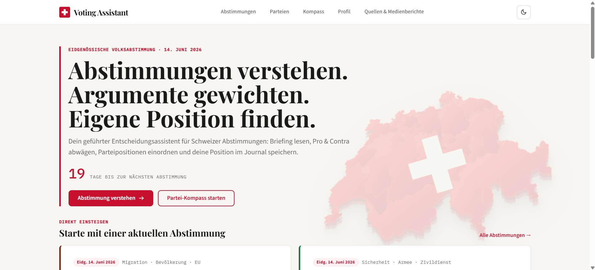

Die Startseite zeigt Hauptnutzen, Navigation, Countdown zur nächsten Abstimmung, primäre CTAs und den Einstieg in aktuelle Vorlagen.

### Abstimmungsübersicht

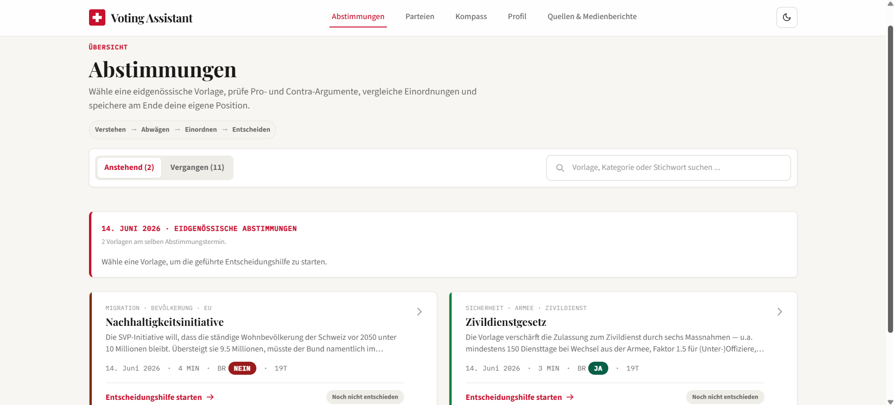

Die Übersicht bündelt anstehende und vergangene Vorlagen mit Tabs, Suche, Filterung und Kartenlayout.

### Abstimmungsdetail und Briefing

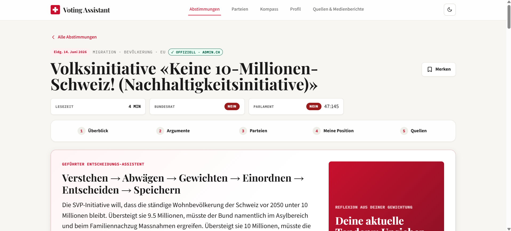

Die Detailseite führt in eine Vorlage ein und zeigt Briefing, Metadaten, Quellenstand und Workflow-Struktur.

### Argumentgewichtung

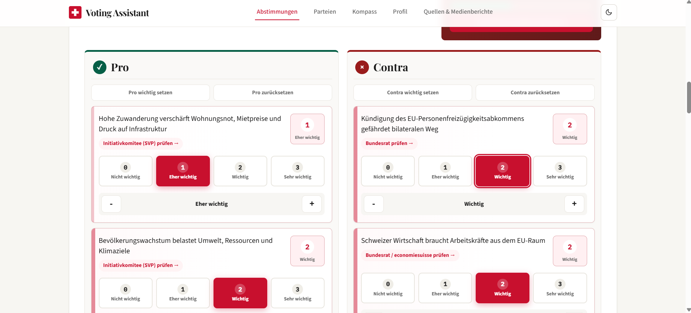

Die Argumentgewichtung macht den Entscheidungsprozess interaktiv: Nutzer:innen gewichten Pro- und Contra-Argumente und sehen daraus eine Live-Tendenz.

### Partei-Kompass

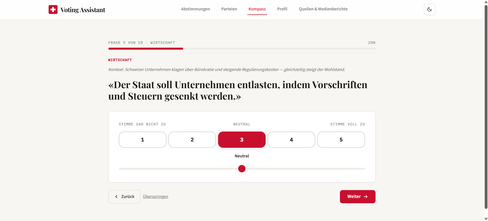

Der Partei-Kompass nutzt Szenario-Fragen mit 5-Stufen-Skala als zweiten Orientierungsworkflow.

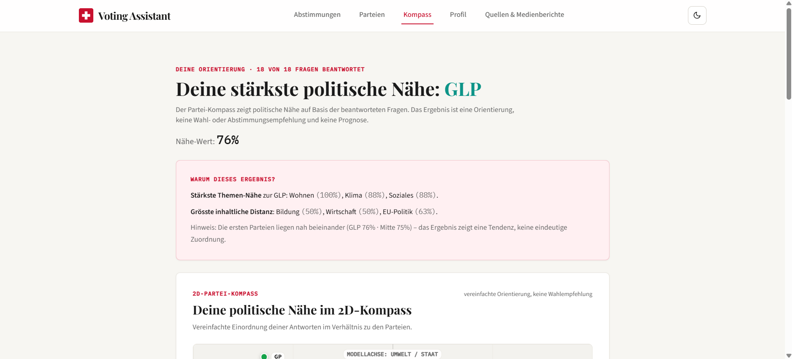

Das Ergebnis zeigt Parteiennähe, Ranking und Themen-Breakdown transparent und ohne Wahlempfehlung.

### Profil und Voting-Journal

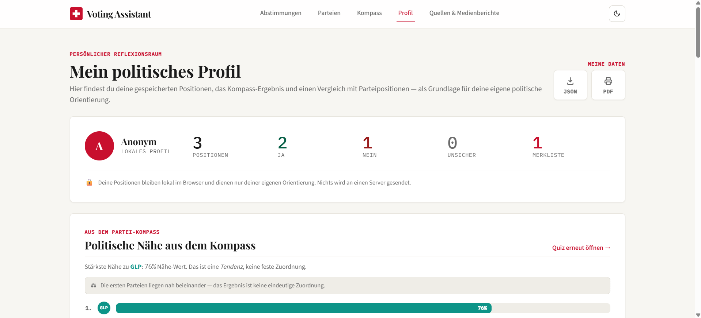

Das Profil zeigt gespeicherte Positionen, Kompass-Ergebnis und persönliche Reflexion im Voting-Journal.

### Parteien

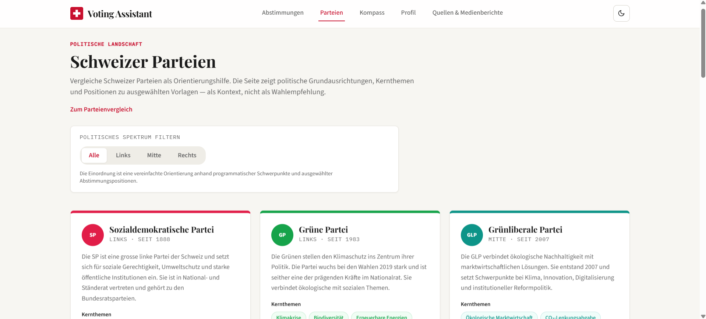

Die Parteienübersicht zeigt die sechs Bundesparteien mit Filter, Vergleich und politischer Einordnung.

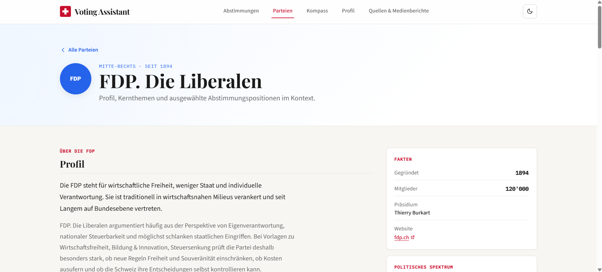

Die Parteidetailseite zeigt Profil, Kernthemen, Spektrum und Positionen zu aktuellen Vorlagen.

### Quellen

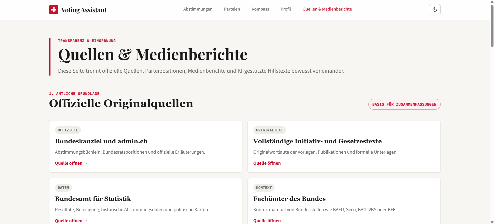

Die Quellen-Seite trennt amtliche Quellen, Parteiquellen, Medienberichte und Methodik transparent.

### Dark Mode

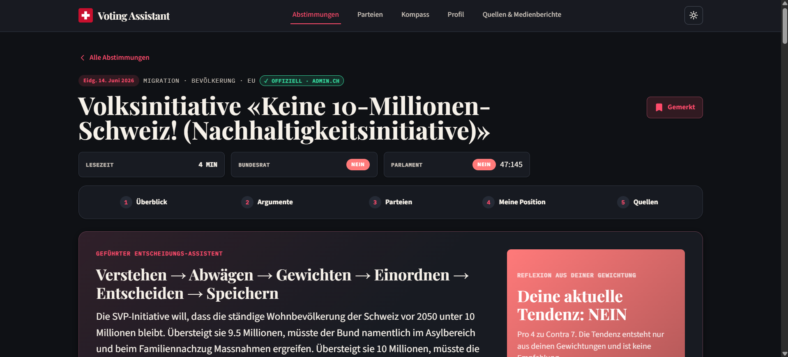

Der Dark Mode zeigt, dass zentrale Workflows auch im dunklen Theme lesbar und konsistent bleiben.

### Mobile Ansicht

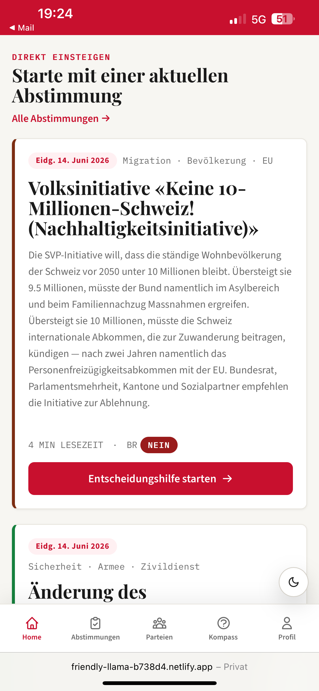

Die mobile Ansicht zeigt Bottom-Navigation, responsive Layouts und die Nutzbarkeit auf Smartphone-Grösse.

### Admin

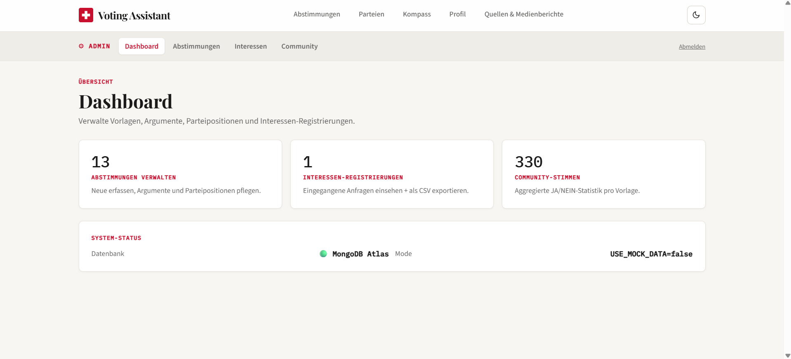

Das Admin-Dashboard dokumentiert Datenpflege, Systemstatus und die technische Grundlage für CRUD-Funktionen. Der Screenshot zeigt den produktiven MongoDB-Atlas-Modus mit `USE_MOCK_DATA=false`.

---

## Projektdokumentation (`docs/`)

Die methodische Dokumentation zu Vorgehen, Evaluation und KI-Einsatz liegt vollständig im Ordner [`docs/`](docs/) und ergänzt die in dieser README zusammengefassten Highlights.

| Dokument | Inhalt |
|---|---|
| [`docs/01-understand.md`](docs/01-understand.md) | Phase 1 — Problemraum, Persona, Annahmen, Risiken bei politischen Themen |
| [`docs/02-sketch.md`](docs/02-sketch.md) | Phase 2 — Frühe Ideen, Variantenvergleich, Skizzen |
| [`docs/03-decide.md`](docs/03-decide.md) | Phase 3 — Gewählte Lösung, MoSCoW-Priorisierung, Abgrenzungen |
| [`docs/04-prototype.md`](docs/04-prototype.md) | Phase 4 — Finale Seitenstruktur, Workflows, technische Umsetzung |
| [`docs/05-validate.md`](docs/05-validate.md) | Phase 5 — Evaluationsplan, Testaufgaben, Beobachtungstabelle, Schweregrad-Skala |
| [`docs/06-ki-einsatz.md`](docs/06-ki-einsatz.md) | KI-Tools (Claude Code, Codex, ChatGPT), Anwendungsbereiche, manuelle Qualitätssicherung |
| [`docs/prompts.md`](docs/prompts.md) | Promptvorgehen, typische Prompt-Muster und Qualitätssicherungsregeln |
| [`docs/07-projektorganisation.md`](docs/07-projektorganisation.md) | Repository, Branches, Commits, Issues, Deployment, technische Schulden |
| [`docs/video-script.md`](docs/video-script.md) | Drehbuch und Sprechertext für den 5-Minuten-Walkthrough |
| [`docs/mockups/`](docs/mockups/README.md) | Ablage und Checkliste für Skizzen und Mockups |
| [`docs/screenshots/`](docs/screenshots/README.md) | Ablage und Checkliste für finale App-Screenshots |

---

## Evaluation

Eine qualitative Usability-Evaluation wurde mit **fünf anonymisierten Testpersonen (P1–P5)** durchgeführt:

- **P1–P3** im Unterricht / ZHAW-Kontext (Haupttest am **20. Mai 2026**, je ca. 10 Minuten).
- **P4–P5** als private Nachtests, um die Stichprobe zu vergrössern und die erweiterten Workflows (Argumentgewichtung, Voting-Journal, Partei-Kompass) ergänzend zu prüfen.

**Bewertung aus der dokumentierten Unterrichts-Evaluation:** **4.2 / 5** im Durchschnitt — Verständlichkeit der Inhalte 5/5, Bedienbarkeit, Neutralität, Design und Gesamteindruck je 4/5. **3 von 3** im Unterricht befragten Personen würden die App vor einer Abstimmung nutzen oder wahrscheinlich nutzen.

**Wichtigste Erkenntnisse:**

- Grundidee, Pro/Contra-Trennung und KI-Briefing wurden positiv aufgenommen.
- Hauptprobleme lagen **nicht in der Grundfunktion**, sondern in **Interaktivitäts-Signalen** (Karten wirken nicht klar anklickbar), im **Desktop-Layout** (zu mobile-artig), in der **Erklärbarkeit** (Live-Tendenz vs. Empfehlung, Kompass-Berechnung) und in der **Nutzerführung** (Wunsch nach Notizen, Reflexion, geführtem Workflow).
- Quellen wurden bei direkter Frage erkannt, aber im ursprünglichen Footer übersehen.

**Wichtigste umgesetzte Verbesserungen aus der Evaluation:**

- **Startseite** und **Detailseite** auf den Hauptworkflow Verstehen → Abwägen → Gewichten → Einordnen → Entscheiden → Speichern fokussiert.
- **Argumentgewichtung mit Live-Tendenz** erklärbarer dargestellt.
- **Eigene Position mit Sicherheit und Notiz** speicherbar (`VoteSection` + `localStorage`).
- **Kompass-Ergebnis** vorsichtiger und transparenter (Sprache «Nähe / Tendenz», ausklappbare Erklärung der Berechnung, Hinweis bei knappem Ergebnis).
- **Profil / Voting-Journal** als persönlicher Reflexionsraum mit Übereinstimmung zu Parteipositionen und Aktivitäten-Timeline.
- **Desktop-Layout** mit eigener TopNav, Full-Width-Container und konsistenter Informationsdichte.
- **Quellen** prominenter pro Argument und auf einer eigenen Quellen- und Medienberichte-Seite.

**Vollständige Dokumentation** mit Fragestellungen, Testaufgaben, Feedback Grid, konsolidierter Issue-Liste (Nielsen-Schweregrad 0–4), Bewertungstabelle, abgeleiteten Verbesserungen und ehrlicher Reflexion zu Limitationen: [`docs/05-validate.md`](docs/05-validate.md).

> **Verbleibende Punkte:** Tooltip für Parteikürzel und ein letzter Design-Konsistenz-Pass bleiben als bewusst abgegrenzte Restpunkte dokumentiert. Die finalen Screenshots des Abgabestands liegen unter [`docs/screenshots/`](docs/screenshots/README.md).

In der App selbst sammelt zusätzlich das [`FeedbackForm`](src/lib/components/FeedbackForm.svelte) am Ende jeder Detailseite niederschwellig Werte zu Clarity, Neutrality und Usefulness — als sekundäre Datenquelle.

---

## KI-Einsatz

Der Voting Assistant ist mit Unterstützung mehrerer KI-Werkzeuge entstanden. Die volle Deklaration mit Anwendungsbereichen, manueller Qualitätssicherung und Reflexion steht in [`docs/06-ki-einsatz.md`](docs/06-ki-einsatz.md).

Kurzüberblick:

| Tool | Hauptzweck |
|---|---|
| **Claude Code** (Anthropic) | Code-Analyse, Refactoring, Dokumentationsstruktur, UX-Verbesserungen, technische Reviews |
| **Codex** (OpenAI) | Fokussierte Coding-Tasks, UI- und Workflow-Verbesserungen, Code-Audits, einzelne Features und Fixes |
| **ChatGPT** (OpenAI) | Projektstrategie, Bewertungsraster-Interpretation, Prompt-Erstellung, UX-Kritik, Priorisierung, Reflexion |

**Wichtig:** Politische Inhalte, Quellen, Neutralität, Funktionalität und finale Entscheidungen wurden manuell überprüft. Die KI hat keine politische Meinung vorgegeben und keine Wahlempfehlung erstellt. Die App ist auf Startseite und Quellen-Seite zusätzlich in-app transparent dazu.

---

## Rechtliche und ethische Hinweise

- **Politische Neutralität.** Pro- und Contra-Argumente werden gleichwertig dargestellt. Die App spricht durchgängig von Tendenz, Orientierung oder Nähe, nicht von Empfehlung.
- **Keine Wahlempfehlung.** Der Voting Assistant ist eine Orientierungshilfe für die persönliche Meinungsbildung und ersetzt weder das Abstimmungsbüchlein noch die Originaltexte der Vorlagen.
- **Quellen.** Briefings und Argumente stützen sich auf admin.ch und bk.admin.ch. Jede Aussage trägt einen Quellen-Link mit Datum. Medienberichte sind kuratierte externe Links (SRF, Watson) und klar als journalistische Perspektive markiert.
- **Datenschutz.** Persönliche Stimmen, Notizen, Bookmarks und Kompass-Ergebnisse bleiben **ausschliesslich lokal** im Browser (`localStorage`). Community-Votes werden anonym aggregiert.
- **KI-Transparenz.** Texte wurden mit KI-Werkzeugen strukturiert und sprachlich verdichtet, anschliessend manuell auf Genauigkeit und Neutralität geprüft. KI generiert keine politischen Empfehlungen.
- **Urheberrecht.** Externe Inhalte werden via Link auf die Originalquelle referenziert. Zusammenfassungen sind eigene Formulierungen auf Basis der amtlichen Quellen.
- **Studentischer Prototyp.** Die App ist eine Modulleistung und keine offizielle Plattform. Ein Disclaimer-Ribbon macht das im UI sichtbar.

---

## Bekannte Grenzen und Future Work

- **Inhalts-Scope:** Aktuell fokussiert auf eidgenössische Abstimmungen. Kantonale und kommunale Vorlagen sind nur exemplarisch als Demo enthalten.
- **Server-State:** Persönliche Stimmen sind bewusst nicht synchronisierbar (Datenschutz-Trade-off). Gerätewechsel verliert das Journal. Ein optionaler Export wäre ein sinnvoller nächster Schritt.
- **Live-News-API:** Medienberichte sind eine kuratierte Auswahl, keine dynamische Anbindung.
- **Tests:** Aktuell keine automatisierten Tests. Ein E2E-Smoke-Test für den Kern-Workflow ist als Future-Work-Punkt dokumentiert.
- **Datenpflege:** Die Datenquelle `realData.ts` wird manuell gehalten. Mittelfristig wäre ein Sync gegen die Bundeskanzlei-API denkbar.
- **Kompass-Visualisierung:** Eine 2D-Spektrum-Anzeige (Links↔Rechts / Wirtschaft↔Umwelt) ist als sinnvolle Erweiterung dokumentiert, die Datenbasis dafür existiert bereits.
- **Evaluation:** Die qualitative Evaluation ist abgeschlossen und in [`docs/05-validate.md`](docs/05-validate.md) dokumentiert. Für ein Produktivsystem wären zusätzliche Tests mit breiterer Stichprobe sinnvoll.

Vollständige Liste von Schulden und Future Work in [`docs/07-projektorganisation.md`](docs/07-projektorganisation.md).

---

## Video-Walkthrough

Ein kommentierter, ca. fünfminütiger Walkthrough wird als finaler Abgabeschritt aufgenommen. Drehbuch, Sprechertext-Entwurf und Aufnahme-Checkliste stehen in [`docs/video-script.md`](docs/video-script.md).

> **Finaler Abgabeschritt:** Video aufnehmen und URL hier ergänzen (Moodle-Upload oder YouTube unlisted).

```
Video-URL: <wird nach Upload ergänzt>
```

---

## Projektkontext

| Bereich | Information |
|---|---|
| Modul | Prototyping (FS 2026) |
| Hochschule | ZHAW School of Management and Law |
| Studiengang | Wirtschaftsinformatik |
| Klasse | WIN24TZb |
| Entwickler | Adi Lama |
| Arbeitsform | Einzelarbeit |

---

## Lizenz und Hinweis

Studentisches Prototyping-Projekt im Modul Prototyping (ZHAW FS 2026). Code zur freien Verwendung im Modul-Kontext. Inhalte sind sinngemäss aus offiziellen Quellen abgeleitet — bei Wiederverwendung bitte auf admin.ch verweisen.

**Dieser Prototyp ist keine offizielle Abstimmungshilfe.** Für rechtsverbindliche Informationen zur eidgenössischen Abstimmung vom 14. Juni 2026 sind ausschliesslich [admin.ch](https://www.admin.ch/de/eidgenoessische-abstimmungen) und das Abstimmungsbüchlein massgebend.
