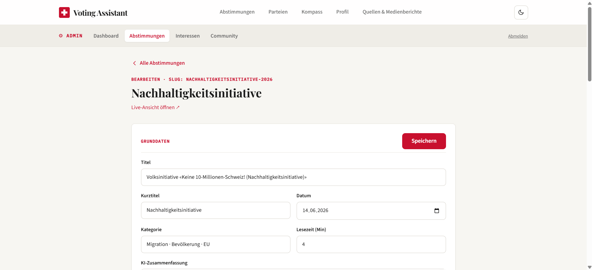
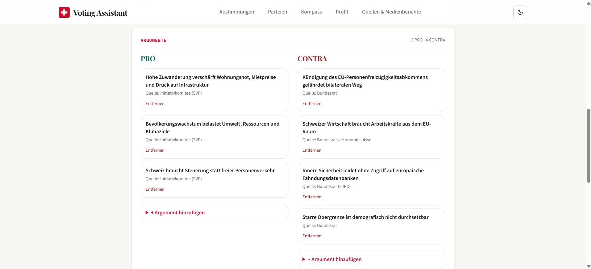
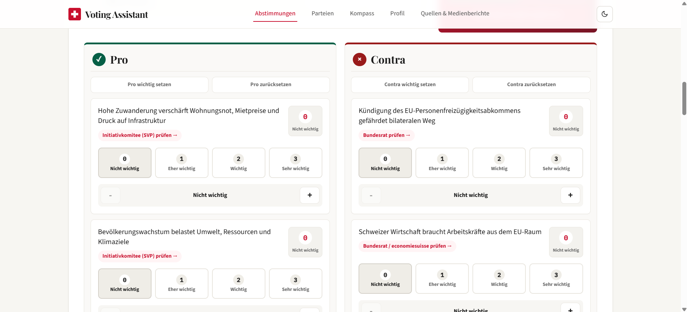
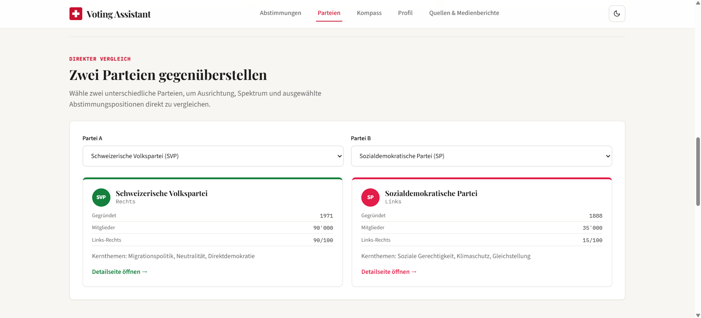
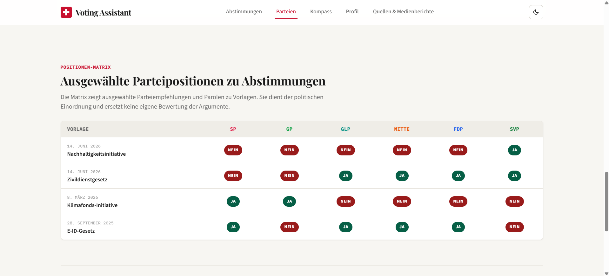
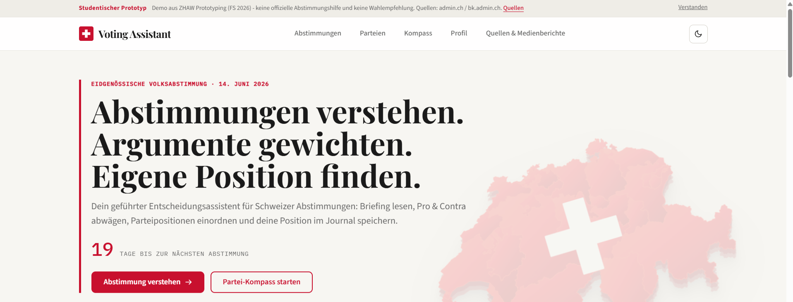

# Phase 4 — Prototype

> Ziel dieser Phase: Den gewählten Entwurf in einen funktionierenden, online zugänglichen Prototyp überführen, der den Mindestumfang erfüllt und die Erweiterungen umsetzt.

---

## Beschreibung des finalen Prototyps

Der Prototyp ist eine vollständig funktionsfähige SvelteKit-Webanwendung mit Server-Routing, MongoDB-Anbindung (mit In-Memory-Fallback im Mock-Modus), persistenter Client-Speicherung im `localStorage`, einem geschützten Admin-Bereich für CRUD-Operationen und einem zusammenhängenden Design-System mit Dark-Mode.

Live: <https://friendly-llama-b738d4.netlify.app>

Die App ist responsiv von 360 px bis 1920 px+ und auf Tastatur- und Screenreader-Bedienung ausgelegt (Skip-Link, ARIA-Attribute, semantische HTML-Struktur, `prefers-reduced-motion`).

## Bezug zwischen Mockup und finalem Prototyp

Die Sketches und Figma-Wireframes aus [`mockups/Uebung9_Abgabe_Adi_Lama.pdf`](mockups/Uebung9_Abgabe_Adi_Lama.pdf) und [`mockups/Uebung10_Abgabe_Adi_Lama.pdf`](mockups/Uebung10_Abgabe_Adi_Lama.pdf) dienten als Ausgangspunkt für Informationsarchitektur, Happy Path und zentrale Screen-Muster. Der finale SvelteKit-Prototyp setzt diese Grundlagen erkennbar um, erweitert sie aber bewusst zu einer responsiven Web-App mit zusätzlichen Workflows.

| Mockup-Artefakt | Umsetzung im finalen Prototyp | Anpassung / Weiterentwicklung |
|---|---|---|
| Home Screen | Startseite mit Hero und aktuellen Abstimmungen | Erweitert um klaren Hauptworkflow, Methodik-Hinweise und CTAs |
| Abstimmungsliste | Abstimmungsübersicht | Erweitert um Desktop-Layout, Cards, Tabs, Filter und Suche |
| Briefing Screen | Abstimmungsdetailseite | Erweitert zum geführten Entscheidungs-Assistenten |
| Split Pro/Contra | Argumentbereich | Erweitert um Gewichtung und Live-Tendenz |
| Parteienraster | Parteipositionen | Erweitert mit Parteidetailseiten, Parteienübersicht und Kompass-Bezug |
| Argument-Detail | Quellenbezug pro Argument | Erweitert um Argument-Detailseiten und Quellen-/Medienberichte |
| Quellen & FAQ | Quellen & Medienberichte | Erweitert um Methodik, Quellenkategorien und KI-Transparenz |
| Bottom Navigation | Responsive Navigation | Erweitert um Desktop TopNav und Mobile Navigation |

Damit erfüllt der Prototyp das Ziel, dass Mockup und finale UI/Flows methodisch zusammenhängen, ohne zu behaupten, dass das finale Produkt eine 1:1-Umsetzung des ursprünglichen Wireframes ist.

## Seitenstruktur

| Route | Datei | Inhalt |
|---|---|---|
| `/` | `src/routes/+page.svelte` | Startseite: Hero mit Countdown, anstehende Vorlagen, Workflow-Erklärung, Methodik, vergangene Resultate, SwissPartyMap, FAQ, Transparenz |
| `/abstimmungen` | `src/routes/abstimmungen/+page.svelte` | Übersicht mit Tabs «Anstehend» / «Vergangen», Suche, Filter, Resultats-Karten |
| `/abstimmungen/[slug]` | `src/routes/abstimmungen/[slug]/+page.svelte` | Detail-Seite: geführter Entscheidungs-Assistent über 5–6 Abschnitte (Überblick, Argumente, Parteien, Meine Position, Quellen) |
| `/abstimmungen/[slug]/argumente/[id]` | `src/routes/abstimmungen/[slug]/argumente/[id]/+page.svelte` | Detailansicht eines einzelnen Arguments mit erweitertem Kontext und Quellenangabe |
| `/abstimmungen/[slug]/parteien` | `src/routes/abstimmungen/[slug]/parteien/+page.svelte` | Vollständige Parteipositionen zu einer Vorlage |
| `/parteien` | `src/routes/parteien/+page.svelte` | Parteienübersicht, Filter, Parteienvergleich (A vs. B), Positionen-Matrix, Methodik |
| `/parteien/[kuerzel]` | `src/routes/parteien/[kuerzel]/+page.svelte` | Parteiprofil mit Kernthemen, Spektrum, Reflexion |
| `/kompass` | `src/routes/kompass/+page.svelte` | Partei-Kompass-Quiz mit 18 Fragen und Ergebnis-Auswertung |
| `/profil` | `src/routes/profil/+page.svelte` | Voting-Journal: Statistiken, Kompass-Ergebnis, Merkliste, Übereinstimmung mit Parteien, Aktivitäten, Stimm-Historie |
| `/quellen` | `src/routes/quellen/+page.svelte` | Quellen & Medienberichte mit Filter und Methodik |
| `/admin` | `src/routes/admin/+page.svelte` | Admin-Dashboard mit Status-Anzeige |
| `/admin/abstimmungen` | `src/routes/admin/abstimmungen/+page.svelte` | CRUD-Übersicht aller Vorlagen |
| `/admin/abstimmungen/new` | `src/routes/admin/abstimmungen/new/+page.svelte` | Neue Abstimmung anlegen |
| `/admin/abstimmungen/[slug]/edit` | `src/routes/admin/abstimmungen/[slug]/edit/+page.svelte` | Vorlage bearbeiten, Argumente und Parteipositionen pflegen |
| `/admin/interessen` | `src/routes/admin/interessen/+page.svelte` | Interessen-Registrierungen einsehen + CSV-Export |
| `/admin/community` | `src/routes/admin/community/+page.svelte` | Aggregierte Community-Votes pro Vorlage |
| `/admin/login` | `src/routes/admin/login/+page.svelte` | Login-Seite (Cookie-basierte Auth) |
| `/api/abstimmungen/[slug]/vote` | `src/routes/api/abstimmungen/[slug]/vote/+server.ts` | POST/GET — anonymer Community-Vote |
| `/api/parteien/interesse` | `src/routes/api/parteien/interesse/+server.ts` | POST — Interessen-Registrierung |
| `/api/admin/interessen.csv` | `src/routes/api/admin/interessen.csv/+server.ts` | GET — CSV-Export |

## Wichtigste Workflows

### a) Abstimmung verstehen und Position speichern

1. Nutzer:in landet auf Startseite und sieht die kommende Vorlage in einer Karte.
2. Klick auf die Karte → Detail-Seite mit Briefing, Metadaten (Bundesrat-Position, Parlament-Stimmen, Lesezeit, Datenqualität).
3. Abschnitt «Überblick»: KI-gestützte Zusammenfassung mit Verweis auf Quelle und Stand-Datum.
4. Abschnitt «Argumente»: Pro- und Contra-Argumente nebeneinander mit Quelle und Quellendatum pro Argument. Über die Detailseite eines Arguments kann man die Quelle prüfen.
5. Abschnitt «Parteien»: Parteipositionen zur Vorlage, jede mit Link auf das Parteiprofil und Verweis auf die Parolen-Quelle.
6. Abschnitt «Meine Position»: 3 Buttons (JA / NEIN / Unsicher), Sicherheits-Slider 0–100 %, Notiz-Feld bis 500 Zeichen. Speichern legt einen Eintrag in `votesStore` und in `engagementStore.journal` an.
7. Anschliessend wird die Position auch im Profil sichtbar.

### b) Argumente gewichten

1. Auf der Detail-Seite Abschnitt «Argumente» (Komponente `ArgumentWeighting.svelte`).
2. Pro Argument vier Buttons: 0 «Nicht wichtig», 1 «Eher wichtig», 2 «Wichtig», 3 «Sehr wichtig».
3. Live wird berechnet: Pro-Punkte, Contra-Punkte, Tendenz (JA / NEIN / Unsicher), Prozentanteil der stärkeren Seite.
4. Die zwei am höchsten gewichteten Argumente werden als «Stärkste gewichtete Gründe» eingeblendet.
5. Über «Gewichtete Tendenz speichern» wird die Tendenz mit ihrer Begründung in das Voting-Journal übernommen (Timeline-Event vom Typ `weights`).

### c) Partei-Kompass absolvieren

1. Start über Bottom-Nav / Top-Nav «Kompass» oder den CTA auf der Startseite.
2. Intro mit Erklärung («18 Fragen aus 10 Themen, 5-Stufen-Skala, überspringbar»).
3. Pro Frage: Themen-Eyebrow, Kontext-Szenario, Fragestellung in Anführungszeichen, 5 Buttons + Fallback-Slider, Skip-Möglichkeit.
4. Am Ende: Ranking aller 6 Parteien, Themen-Breakdown (10 Themenbereiche × prozentuale Nähe), Erklärung der Berechnung, knappes Ergebnis explizit markiert.
5. Ergebnis wird im `kompassStore` lokal gespeichert und auf der Profil-Seite angezeigt.
6. Optionen: «Antworten überprüfen / anpassen», «Mehr über die Top-Partei erfahren», «Profil ansehen», «Quiz neu starten».

### d) Profil / Voting-Journal nutzen

1. Über Top-/BottomNav «Profil».
2. Header: Pseudonym «Anonym» + 5 Zähler (Positionen, Ja, Nein, Unsicher, Merkliste).
3. Hinweis bei niedriger Datenbasis (< 3 Positionen).
4. Wenn vorhanden: Kompass-Block mit Top-3-Parteien.
5. Merkliste (Bookmarks) mit Card-Layout pro Vorlage.
6. Block «Übereinstimmung mit Parteipositionen»: berechnet aus den gespeicherten Ja/Nein-Stimmen relativ zu den Partei-Parolen.
7. Activity-Stream der letzten 5 Aktionen.
8. Voting-Journal-Karten pro gespeicherter Position: Position, Sicherheit, Notiz, offizielle Empfehlungen, Endergebnis (bei vergangenen Vorlagen).
9. Notizen können nachträglich bearbeitet, Positionen aktualisiert oder gelöscht werden.

### e) Quellen prüfen

1. Über Top-/BottomNav «Quellen & Medienberichte».
2. Vier Kategorien sind sauber visuell getrennt:
   - **Offizielle Originalquellen** (admin.ch, bk.admin.ch, abstimmungen.admin.ch)
   - **Parteipositionen** (Interessenpositionen, nicht-neutral)
   - **Medienberichte** mit Filter (Überblick / Hintergrund / Pro / Contra / Faktencheck / Parteienreaktionen) und Gruppierung pro Abstimmung
   - **Methodik & Transparenz** mit expliziter KI-Deklaration
3. Direkte Sprünge in die jeweilige Originalquelle.

## Technische Umsetzung

### Stack

- **SvelteKit 2** (`@sveltejs/kit ^2.5.0`) als Framework
- **Svelte 4** (`^4.2.15`) als UI-Bibliothek
- **TypeScript 5.4** mit strict-Konfiguration
- **Tailwind CSS 3.4** + eigene CSS-Variablen in `src/app.css`
- **MongoDB 6.6** mit `@sveltejs/adapter-netlify ^4.0.0`

### Datenmodell

Zentrale Types in [`src/lib/types.ts`](../src/lib/types.ts):

```ts
type UserPosition = 'JA' | 'NEIN' | 'UNENTSCHIEDEN';
type DataQuality  = 'official' | 'official-pending' | 'demo';

interface Abstimmung {
  id, slug, title, shortTitle, date, type, category, readTime,
  status, dataQuality,
  bundesratPosition, parlamentPosition, parlamentStimmen,
  aiSummary, summarySource, summarySourceUrl, summaryLastChecked,
  proArguments: Argument[],
  contraArguments: Argument[],
  parteien: Partei[],
  result?: AbstimmungResult
}

interface Argument {
  id, text, source, sourceUrl, sourceDate?, detail?
}

interface Partei {
  kuerzel, name, position, statement, color,
  parolenQuelle?, parolenQuelleUrl?
}
```

Strukturierte Schweizer Abstimmungsdaten sind in [`src/lib/realData.ts`](../src/lib/realData.ts) typsicher gepflegt (2 anstehende + 11 vergangene eidgenössische Vorlagen, Stand: 23. Mai 2026). Parteien-Profile in [`src/lib/parteiData.ts`](../src/lib/parteiData.ts), Kompass-Fragen und -Algorithmus in [`src/lib/kompass.ts`](../src/lib/kompass.ts).

### Stores (Client-State)

- [`votes.ts`](../src/lib/stores/votes.ts) — Stimmen mit Notiz und `updatedAt`, persistiert in `localStorage` unter `votes_v2` (mit Migration aus `votes_v1`).
- [`engagement.ts`](../src/lib/stores/engagement.ts) — Bookmarks, Argument-Gewichte, Journal-Timeline, Feedback, Assistant-Resultate.
- [`theme.ts`](../src/lib/stores/theme.ts) — Light/Dark mit FOUC-freier Initialisierung in `app.html`.
- [`toast.ts`](../src/lib/stores/toast.ts) — Benachrichtigungen.
- [`kompass.ts`](../src/lib/stores/kompass.ts) — Kompass-Antworten und -Resultate.

### Server-Schicht

- [`db.ts`](../src/lib/server/db.ts) — MongoDB-Connection mit Timeout, Cache und Fallback.
- [`dataLayer.ts`](../src/lib/server/dataLayer.ts) — Unified Data Layer: nutzt MongoDB, wenn `MONGODB_URI` gesetzt ist und `USE_MOCK_DATA=false` gilt; sonst In-Memory-Store mit Seed-Daten. Routen importieren ausschliesslich aus dem Data Layer.
- [`abstimmungenStore.ts`](../src/lib/server/abstimmungenStore.ts), [`communityStore.ts`](../src/lib/server/communityStore.ts), [`interesseStore.ts`](../src/lib/server/interesseStore.ts) — In-Memory-Implementierungen.
- [`hooks.server.ts`](../src/hooks.server.ts) — Admin-Auth-Guard: setzt `event.locals.adminAuthed`, redirected geschützte Routen zur Login-Seite, lässt Login-Seite nicht durch, wenn schon authentifiziert.

### API-Endpoints

- `POST /api/abstimmungen/[slug]/vote` — Community-Vote registrieren (Cookie-basierte Idempotenz pro Client).
- `GET  /api/abstimmungen/[slug]/vote` — Aggregat lesen (Ja-/Nein-/Total-Counts).
- `POST /api/parteien/interesse` — Interessen-Registrierung.
- `GET  /api/admin/interessen.csv` — CSV-Export, UTF-8 mit BOM für Excel-Kompatibilität.

### Komponenten (Auszug)

- `AppBar.svelte` — Mobile Detail-Header mit Back-Button und Bookmark.
- `TopNav.svelte` / `BottomNav.svelte` — Desktop- und Mobile-Navigation.
- `AbstimmungCard.svelte` — Listendarstellung einer Vorlage.
- `VotingAssistant.svelte` — Workflow-Block mit 6 Schritten und Live-Tendenz.
- `ArgumentWeighting.svelte` — 4-Stufen-Gewichtung mit Live-Score und Top-Gründen.
- `VoteSection.svelte` — Position + Sicherheit + Notiz + Vergleich mit BR/Parlament/Community.
- `VotingJournal.svelte` — Kompakte Journal-Karte im Detail.
- `Badge.svelte`, `DataQualityBadge.svelte`, `FavoriteButton.svelte` — UI-Primitives.
- `SwissPartyMap.svelte` — Visualisierung der Parteistärken pro Kanton.
- `DisclaimerRibbon.svelte` — Einmalig dismissbar, kennzeichnet als Prototyp.
- `ToastContainer.svelte` — Globale Benachrichtigungen.
- `FeedbackForm.svelte` — In-App-Feedback für die Evaluation.

### Persistenz

- **Server-seitig:** MongoDB Atlas (Collections `abstimmungen`, `communityVotes`, `parteiInteressen`).
- **Client-seitig:** `localStorage` (Keys `votes_v2`, `engagement_v1`, `theme_v1`, `kompass_v1`).
- **Cookies:** `admin_session` für die Admin-Auth, anonymes Client-Cookie für Vote-Idempotenz.

### Datenbank- und CRUD-Erfüllung

Die App erfüllt die Mindestanforderung **«Daten werden aus einer Datenbank geladen und angezeigt; Daten können erstellt und/oder aktualisiert werden»** über eine klare Server-Schicht:

- MongoDB Atlas wird verwendet, wenn `MONGODB_URI` gesetzt ist und `USE_MOCK_DATA=false` gilt.
- Ohne diese Konfiguration nutzt die App einen Seed-/Fallback-Modus mit strukturierten Daten und In-Memory-Stores, damit der Prototyp lokal und für Demos weiterhin funktioniert.
- Secret-Werte wie `MONGODB_URI` und `ADMIN_PASSWORD` werden nicht im Repository dokumentiert.

| Bereich | Quelle / Persistenz | Zweck |
|---|---|---|
| Abstimmungen, Argumente, Parteipositionen | MongoDB Collection `abstimmungen` | Öffentliche Seiten laden Vorlagen, Briefings, Argumente und Parteipositionen über den Data Layer |
| Community Votes | MongoDB Collection `communityVotes` | Anonyme JA/NEIN-Aggregation pro Vorlage |
| Interessen-Registrierungen | MongoDB Collection `parteiInteressen` | Server-seitige Erfassung und Admin-/CSV-Auswertung |
| Persönliche Positionen, Notizen, Journal | `localStorage` | Datenschutzfreundliche persönliche Daten ohne Konto |
| Kompass-Ergebnis | `localStorage` | Persönliches Ergebnis bleibt im Browser |
| Parteienprofile und Kompass-Fragen | Statische TypeScript-Daten | Strukturierte Referenzdaten, keine User- oder Admin-Daten |
| Seed-/Fallback-Daten | `realData.ts` + In-Memory-Stores | Robuste Anzeige, wenn MongoDB nicht aktiv ist |

CRUD-Funktionen:

| Aktion | Ort | Persistenz bei aktivem MongoDB-Modus |
|---|---|---|
| Abstimmung erstellen | `/admin/abstimmungen/new` | Neuer Eintrag in `abstimmungen` |
| Abstimmung löschen | `/admin/abstimmungen` | Löschen aus `abstimmungen` |
| Metadaten bearbeiten | `/admin/abstimmungen/[slug]/edit` | Update in `abstimmungen` |
| Argument hinzufügen / löschen | `/admin/abstimmungen/[slug]/edit` | Update der Pro-/Contra-Argumente in `abstimmungen` |
| Parteipositionen bearbeiten | `/admin/abstimmungen/[slug]/edit` | Update des Parteien-Arrays in `abstimmungen` |
| Community Vote abgeben | `/api/abstimmungen/[slug]/vote` | Upsert in `communityVotes` pro Browser-Cookie |
| Interessen erfassen | `/api/parteien/interesse` | Neuer Eintrag in `parteiInteressen` |
| Interessen exportieren | `/api/admin/interessen.csv` | CSV aus `parteiInteressen` |
| Persönliche Position / Notiz ändern | Detailseite und Profil | Update im Browser-`localStorage` |

Im Walkthrough werden für die Bewertung explizit sichtbar gemacht: Admin-Login, Dashboard mit MongoDB-Status, Bearbeiten einer Vorlage oder eines Arguments, sichtbare Änderung auf der öffentlichen Seite sowie ein Community-Vote mit aggregierter Anzeige.

## Interaktivität — Highlights

- **Argument-Gewichtung** mit Live-Tendenz, visualisiert in einem farbigen Score-Block (Brand / Pro / Contra je nach Tendenz).
- **Live-Speicherung** persönlicher Eingaben — kein zusätzlicher Speichern-Klick nötig (ausser für die finale Position).
- **Voting-Journal** mit zeitlich sortierter Timeline aller Aktionen und Möglichkeit, Position, Sicherheit und Notiz nachträglich zu ändern.
- **Partei-Kompass** mit 5-Stufen-Skala, Skip-Mechanismus, dynamischem Topic-Breakdown und Erklärung der Berechnung.
- **Filter und Suche** auf Abstimmungs-Übersicht (Stichwort, Status, Tab).
- **Filter** auf Quellen-Seite (Pro Abstimmung / Pro Kategorie).
- **Theme-Toggle** mit FOUC-freier Initialisierung (Inline-Script in `app.html`).
- **In-View-Animationen** über die Custom-Action `use:inView` (`src/lib/actions/inView.ts`).

## Screenshots der App

Die finalen Screenshots liegen unter [`screenshots/`](screenshots/README.md). Sie dokumentieren den sichtbaren Abgabestand der wichtigsten Ansichten und Workflows.

### Startseite


Hero, Navigation, Countdown, primäre CTAs und Einstieg in die aktuellen Abstimmungen.

### Abstimmungsübersicht


Übersicht mit Tabs, Suche, Filterlogik und Vorlagen-Karten.

### Abstimmungsdetail und Briefing


Detailseite mit neutralem Briefing, Metadaten, Quellenstand und Workflow-Struktur.

### Argumentgewichtung


Interaktive Gewichtung von Pro- und Contra-Argumenten mit Live-Tendenz.

### Partei-Kompass


Kompass-Frage mit Themenkontext, 5-Stufen-Skala und Fortschritt.


Ergebnisansicht mit Ranking, Top-Match und transparenter Einordnung.

### Profil und Parteien


Profil mit gespeicherten Positionen, Kompass-Bezug und Voting-Journal.


Parteienübersicht mit Filter, Vergleich und Positionen-Matrix.


Parteidetailseite mit Profil, Kernthemen, Spektrum und aktuellen Positionen.

### Quellen, Mobile und Admin


Quellen-Seite mit Trennung von amtlichen Quellen, Parteiquellen, Medien und Methodik.


Dark-Mode-Ansicht als Nachweis für konsistente Lesbarkeit im alternativen Theme.


Mobile Ansicht mit Bottom-Navigation und responsive optimiertem Layout.


Admin-Dashboard mit Datenpflege-Einstiegen, Kennzahlen und transparentem Systemstatus. Der Screenshot zeigt den produktiven MongoDB-Atlas-Modus mit `USE_MOCK_DATA=false`.

### Admin-CRUD im Detail



Edit-Ansicht einer Vorlage im Admin-Bereich. Titel, Slug, Datum, Kategorie und Lesezeit sind editierbar; gespeichert wird direkt in die Collection `abstimmungen`.



Argument-Sektion derselben Edit-Seite. Pro- und Contra-Argumente lassen sich mit Quelle anlegen, bearbeiten und entfernen — das belegt den Create-/Update-/Delete-Teil der CRUD-Funktion sichtbar.

### Erweiterte Argumentgewichtung



Erweiterte Ansicht der Argumentgewichtung. Über die Bulk-Aktionen «Pro wichtig setzen» bzw. «Pro zurücksetzen» (analog für Contra) können Nutzer:innen die 0–3-Bewertung einer ganzen Spalte in einem Schritt anpassen.

### Parteivergleich und Positionen-Matrix



Direkter Parteivergleich mit Eckdaten, Gründungsdatum, Mitgliederzahl, Links-Rechts-Skala und Kernthemen.



Positionen-Matrix der sechs Bundesparteien zu ausgewählten Vorlagen mit JA/NEIN-Parolen auf einen Blick.

### Disclaimer-Ribbon



Global eingebundener Disclaimer-Ribbon mit Quellenverweis und Dismiss-Button. Der Status wird nutzerspezifisch in `localStorage` unter `disclaimer_dismissed_v1` gespeichert.

---

**Nächste Phase:** [`05-validate.md`](05-validate.md) — Evaluationsplan, Durchführung, Auswertung.
